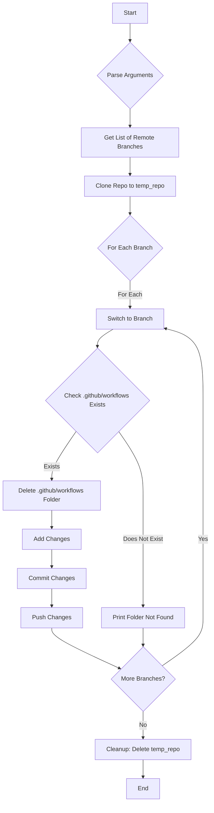

```mermaid
graph TD
    A[Start] --> B{Parse Arguments}
    B --> C[Get List of Remote Branches]
    C --> D[Clone Repo to temp_repo]
    D --> E{For Each Branch}
    E -->|For Each| F[Switch to Branch]
    F --> G{Check .github/workflows Exists}
    G -->|Exists| H[Delete .github/workflows Folder]
    H --> I[Add Changes]
    I --> J[Commit Changes]
    J --> K[Push Changes]
    G -->|Does Not Exist| L[Print Folder Not Found]
    K --> M{More Branches?}
    L --> M
    M -->|Yes| F
    M -->|No| N[Cleanup: Delete temp_repo]
    N --> O[End]
```