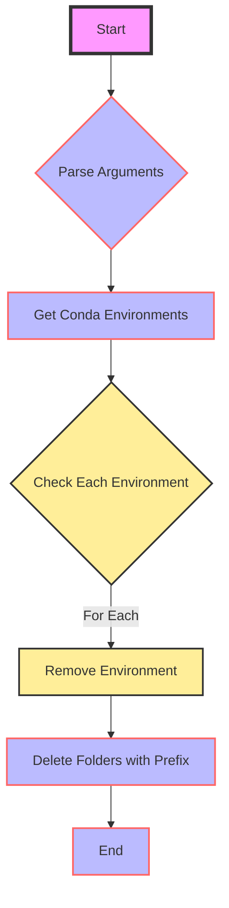

```mermaid
graph TD
    A[Start] --> B{Parse Arguments}
    B --> C[Get Conda Environments]
    C --> D{Check Each Environment}
    D -->|For Each| E[Remove Environment]
    E --> F[Delete Folders with Prefix]
    F --> G[End]

    classDef startend fill:#f9f,stroke:#333,stroke-width:4px;
    classDef operation fill:#bbf,stroke:#f66,stroke-width:2px;
    classDef condition fill:#fe9,stroke:#333,stroke-width:2px;
    class A startend;
    class B,C,F,G operation;
    class D,E condition;
```