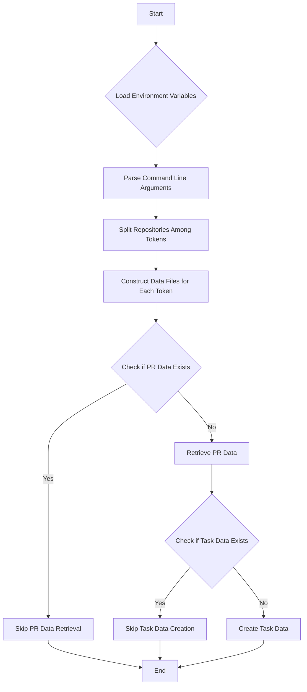

```mermaid
graph TD
    A[Start] --> B{Load Environment Variables}
    B --> C[Parse Command Line Arguments]
    C --> D[Split Repositories Among Tokens]
    D --> E[Construct Data Files for Each Token]
    E --> F{Check if PR Data Exists}
    F -->|Yes| G[Skip PR Data Retrieval]
    F -->|No| H[Retrieve PR Data]
    H --> I{Check if Task Data Exists}
    I -->|Yes| J[Skip Task Data Creation]
    I -->|No| K[Create Task Data]
    K --> L[End]
    G --> L
    J --> L
```