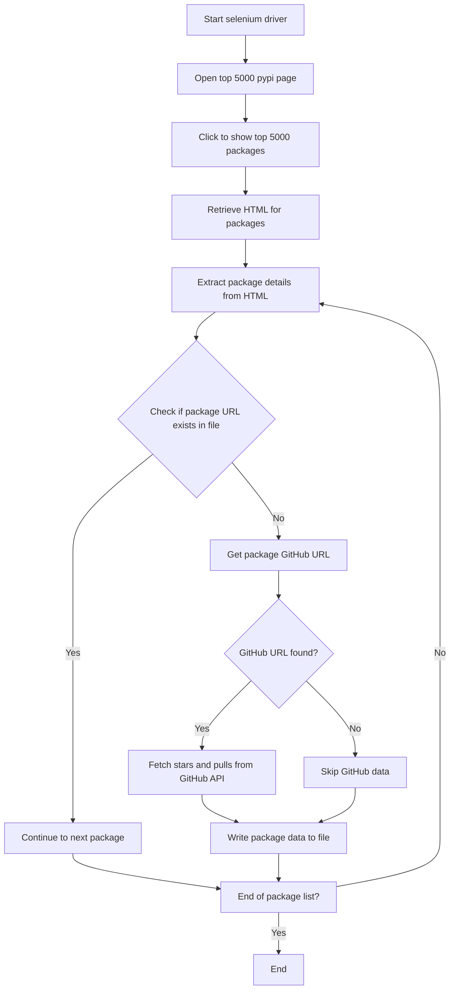

This flowchart represents the process of extracting package statistics from a top 5000 PyPI packages page, enriching the data with GitHub statistics, and writing the results to a file. The process starts with initializing a Selenium driver to navigate the web page, clicking to reveal the top 5000 packages, and then parsing the HTML to extract package details. For each package, it checks if the URL already exists in the output file to avoid duplicates. If not, it attempts to find the package's GitHub URL from the package's PyPI page. If a GitHub URL is found, it fetches star and pull request counts using the GitHub API. Finally, it writes the package data, including GitHub statistics if available, to a file, iterating through all packages in the list.