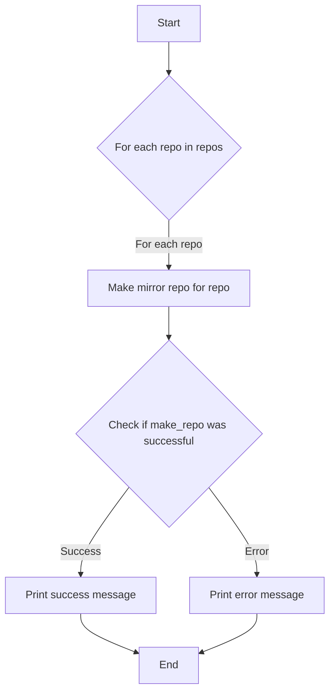

```mermaid
graph TD
    A[Start] --> B{For each repo in repos}
    B -->|For each repo| C[Make mirror repo for repo]
    C --> D{Check if make_repo was successful}
    D -->|Success| E[Print success message]
    D -->|Error| F[Print error message]
    E --> G[End]
    F --> G
```