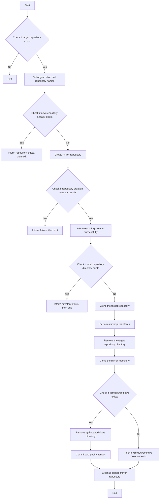

```mermaid
graph TD
    A[Start] --> B{Check if target repository exists}
    B -->|No| C[Exit]
    B -->|Yes| D[Set organization and repository names]
    D --> E{Check if new repository already exists}
    E -->|Yes| F[Inform repository exists, then exit]
    E -->|No| G[Create mirror repository]
    G --> H{Check if repository creation was successful}
    H -->|No| I[Inform failure, then exit]
    H -->|Yes| J[Inform repository created successfully]
    J --> K{Check if local repository directory exists}
    K -->|Yes| L[Inform directory exists, then exit]
    K -->|No| M[Clone the target repository]
    M --> N[Perform mirror push of files]
    N --> O[Remove the target repository directory]
    O --> P[Clone the mirror repository]
    P --> Q{Check if .github/workflows exists}
    Q -->|Yes| R[Remove .github/workflows directory]
    R --> S[Commit and push changes]
    Q -->|No| T[Inform .github/workflows does not exist]
    S --> U[Cleanup cloned mirror repository]
    T --> U
    U --> V[End]
```