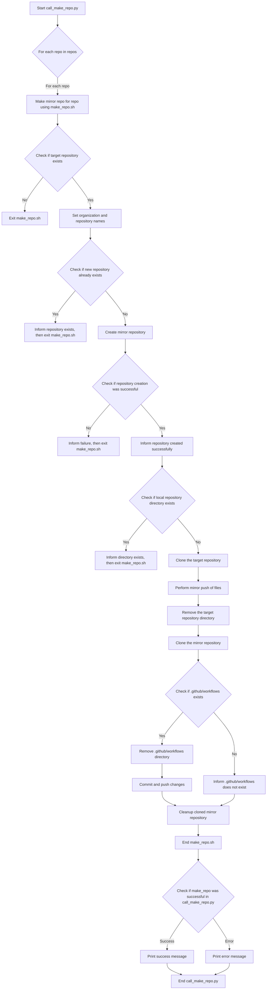

```mermaid
graph TD
    A[Start call_make_repo.py] --> B{For each repo in repos}
    B -->|For each repo| C[Make mirror repo for repo using make_repo.sh]
    C --> D{Check if target repository exists}
    D -->|No| E[Exit make_repo.sh]
    D -->|Yes| F[Set organization and repository names]
    F --> G{Check if new repository already exists}
    G -->|Yes| H[Inform repository exists, then exit make_repo.sh]
    G -->|No| I[Create mirror repository]
    I --> J{Check if repository creation was successful}
    J -->|No| K[Inform failure, then exit make_repo.sh]
    J -->|Yes| L[Inform repository created successfully]
    L --> M{Check if local repository directory exists}
    M -->|Yes| N[Inform directory exists, then exit make_repo.sh]
    M -->|No| O[Clone the target repository]
    O --> P[Perform mirror push of files]
    P --> Q[Remove the target repository directory]
    Q --> R[Clone the mirror repository]
    R --> S{Check if .github/workflows exists}
    S -->|Yes| T[Remove .github/workflows directory]
    T --> U[Commit and push changes]
    S -->|No| V[Inform .github/workflows does not exist]
    U --> W[Cleanup cloned mirror repository]
    V --> W
    W --> X[End make_repo.sh]
    X --> Y{Check if make_repo was successful in call_make_repo.py}
    Y -->|Success| Z[Print success message]
    Y -->|Error| AA[Print error message]
    Z --> AB[End call_make_repo.py]
    AA --> AB
```