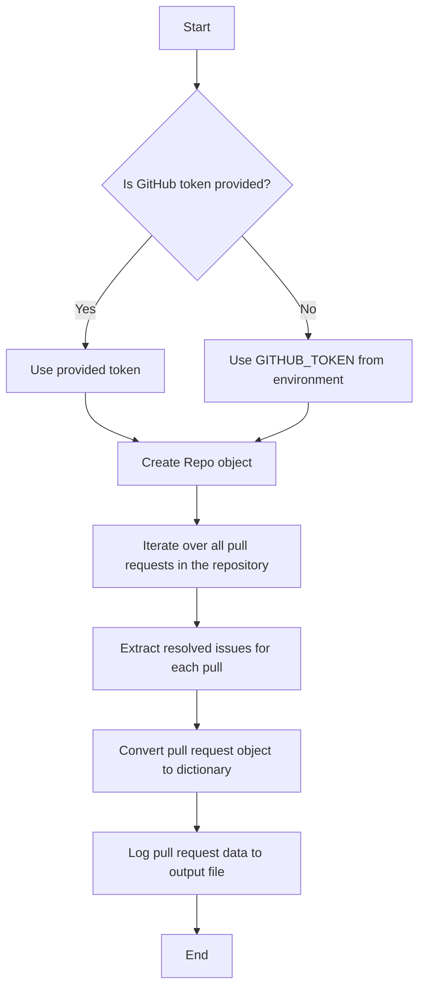

```mermaid
flowchart TD
    A[Start] --> B{Is GitHub token provided?}
    B -- Yes --> C[Use provided token]
    B -- No --> D[Use GITHUB_TOKEN from environment]
    C --> E[Create Repo object]
    D --> E
    E --> F[Iterate over all pull requests in the repository]
    F --> G[Extract resolved issues for each pull]
    G --> H[Convert pull request object to dictionary]
    H --> I[Log pull request data to output file]
    I --> J[End]
```