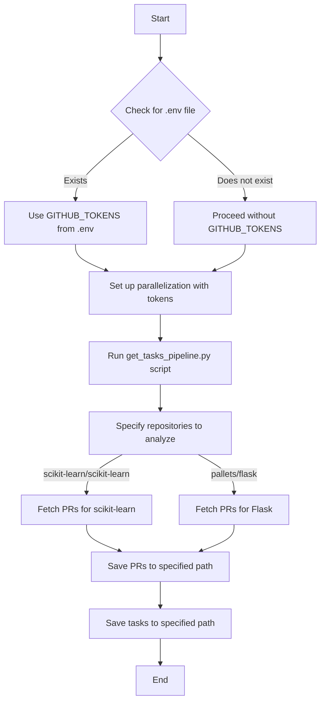

```mermaid
graph TD
    A[Start] --> B{Check for .env file}
    B -->|Exists| C[Use GITHUB_TOKENS from .env]
    B -->|Does not exist| D[Proceed without GITHUB_TOKENS]
    C --> E[Set up parallelization with tokens]
    D --> E
    E --> F[Run get_tasks_pipeline.py script]
    F --> G[Specify repositories to analyze]
    G -->|scikit-learn/scikit-learn| H[Fetch PRs for scikit-learn]
    G -->|pallets/flask| I[Fetch PRs for Flask]
    H --> J[Save PRs to specified path]
    I --> J
    J --> K[Save tasks to specified path]
    K --> L[End]
```