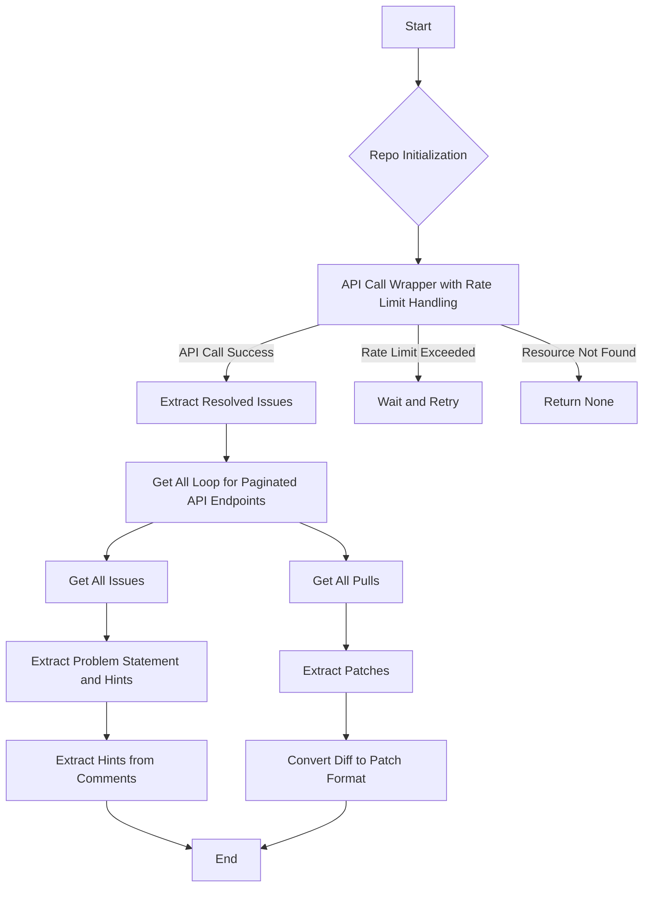

This flowchart represents the sequence of operations performed by the code in the `swe-bench` project. It starts with the initialization of a `Repo` object, which involves making an API call. If the API call is successful, the process moves to extracting resolved issues from pull requests. If the rate limit is exceeded during any API call, the system waits and retries. If a resource is not found, it returns `None`.

The `get_all_loop` method is used for retrieving all items from paginated API endpoints, which is a crucial step for both getting all issues and all pull requests from the repository. These issues and pull requests are then used to extract problem statements, hints, and patches. Hints are extracted from comments associated with a pull request before the first commit, and patches are generated by converting the diff obtained from a pull request into a patch format, excluding specific metadata and categorizing changes into either test or general changes. The process ends after extracting hints and patches.