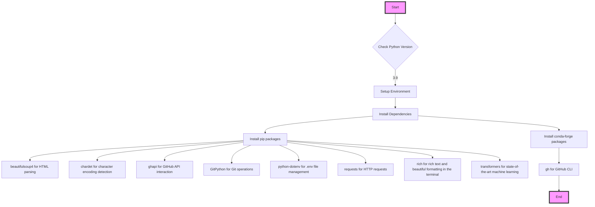

```mermaid
graph TD
    A[Start] --> B{Check Python Version}
    B -->|3.9| C[Setup Environment]
    C --> D[Install Dependencies]
    D --> E[Install pip packages]
    E --> F[beautifulsoup4 for HTML parsing]
    E --> G[chardet for character encoding detection]
    E --> H[ghapi for GitHub API interaction]
    E --> I[GitPython for Git operations]
    E --> J[python-dotenv for .env file management]
    E --> K[requests for HTTP requests]
    E --> L[rich for rich text and beautiful formatting in the terminal]
    E --> M[transformers for state-of-the-art machine learning]
    D --> N[Install conda-forge packages]
    N --> O[gh for GitHub CLI]
    O --> P[End]

    style A fill:#f9f,stroke:#333,stroke-width:4px
    style P fill:#f9f,stroke:#333,stroke-width:4px
```