```mermaid
flowchart TB
    subgraph swe_bench ["swe-bench"]
    direction TB
    create_maps[("Create Version-to-Install Maps")]
    update_maps[("Update Version-to-Install Maps with Additional Versions")]
    consolidate_maps[("Consolidate Maps into MAP_VERSION_TO_INSTALL")]
    define_constants[("Define Constants for Test Frameworks, Requirement Paths, and Environment Paths")]
    define_keys[("Define Evaluation Keys")]
    define_logging[("Define Logging Constants")]
    define_misc[("Define Miscellaneous Constants")]

    create_maps --> update_maps
    update_maps --> consolidate_maps
    consolidate_maps --> define_constants
    define_constants --> define_keys
    define_keys --> define_logging
    define_logging --> define_misc
    end

    subgraph larger_project ["Larger Project"]
    direction TB
    init_env[("Initialize Environment Based on MAP_VERSION_TO_INSTALL")]
    apply_patches[("Apply Patches if Necessary")]
    install_dependencies[("Install Dependencies")]
    run_tests[("Run Tests Using Defined Test Frameworks")]
    evaluate[("Evaluate Test Outcomes")]
    log_results[("Log Results")]

    init_env --> apply_patches
    apply_patches --> install_dependencies
    install_dependencies --> run_tests
    run_tests --> evaluate
    evaluate --> log_results
    end

    swe_bench -->|Used for| larger_project
```

This flowchart represents the low-level purpose of the code within the `swe-bench` project. It starts with the creation and updating of version-to-install maps for various libraries and frameworks. These maps are then consolidated into a single map (`MAP_VERSION_TO_INSTALL`) which is used throughout the project. Constants for test frameworks, requirement paths, and environment paths are defined, along with evaluation keys and logging constants. Miscellaneous constants are also defined to support the project's operations.

In the context of the larger project, these maps and constants are utilized to initialize environments specific to different versions of libraries/frameworks, apply necessary patches, install dependencies, run tests using defined frameworks, evaluate test outcomes, and log the results. This process ensures that the `swe-bench` project can dynamically support a wide range of library versions and configurations for testing and evaluation purposes.