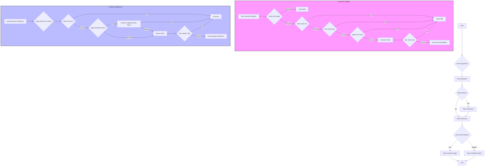

This mermaid diagram illustrates the flow of the code in the `swe-bench` project, focusing on the low-level operations and how they might be utilized in a larger context. The diagram is divided into main operations, including handling command-line arguments, processing predictions, and the detailed steps within the `overwrite_ablation` and `evaluate_predictions` functions, highlighting their roles in the project's workflow.