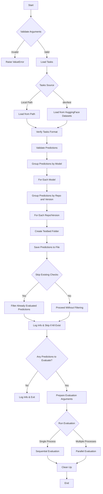

```mermaid
flowchart TD
    A[Start] --> B{Validate Arguments}
    B -->|Invalid| C[Raise ValueError]
    B -->|Valid| D[Load Tasks]
    D --> E{Tasks Source}
    E -->|Local Path| F[Load from Path]
    E -->|dev/test| G[Load from HuggingFace Datasets]
    F --> H[Verify Tasks Format]
    G --> H
    H --> I[Validate Predictions]
    I --> J[Group Predictions by Model]
    J --> K[For Each Model]
    K --> L[Group Predictions by Repo and Version]
    L --> M[For Each Repo/Version]
    M --> N[Create Testbed Folder]
    N --> O[Save Predictions to File]
    O --> P{Skip Existing Checks}
    P -->|Yes| Q[Filter Already Evaluated Predictions]
    P -->|No| R[Proceed Without Filtering]
    Q --> S[Log Info & Skip if All Exist]
    R --> S
    S --> T{Any Predictions to Evaluate?}
    T -->|No| U[Log Info & Exit]
    T -->|Yes| V[Prepare Evaluation Arguments]
    V --> W{Run Evaluation}
    W -->|Single Process| X[Sequential Evaluation]
    W -->|Multiple Processes| Y[Parallel Evaluation]
    X --> Z[Clean Up]
    Y --> Z
    Z --> AA[End]
```