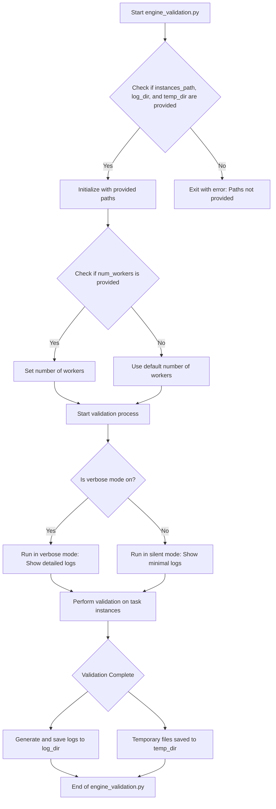

This flowchart represents the steps executed by the `engine_validation.py` script within the context of its operational environment, focusing on the initialization, configuration, and execution phases, including error handling and output management.