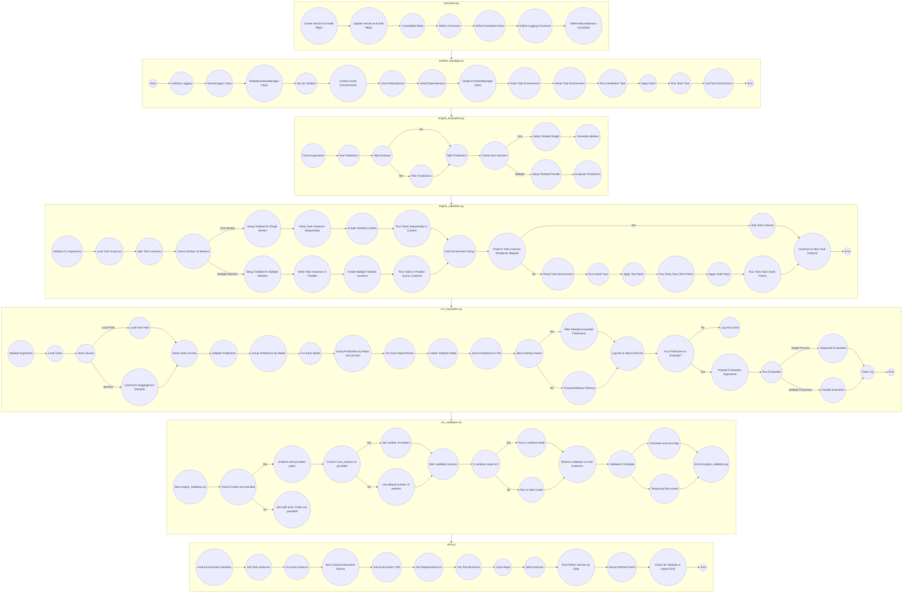

```mermaid
flowchart TB
    subgraph constants_section["constants.py"]
    create_maps(("Create Version-to-Install Maps")) --> update_maps(("Update Version-to-Install Maps"))
    update_maps --> consolidate_maps(("Consolidate Maps"))
    consolidate_maps --> define_constants(("Define Constants"))
    define_constants --> define_keys(("Define Evaluation Keys"))
    define_keys --> define_logging(("Define Logging Constants"))
    define_logging --> define_misc(("Define Miscellaneous Constants"))
    end

    subgraph context_manager_section["context_manager.py"]
    start(("Start")) --> init_logging(("Initialize Logging"))
    init_logging --> exec_wrapper(("ExecWrapper Class"))
    exec_wrapper --> testbed_context_manager(("TestbedContextManager Class"))
    testbed_context_manager --> setup_testbed(("Set Up Testbed"))
    setup_testbed --> create_conda_env(("Create Conda Environments"))
    create_conda_env --> clone_repo(("Clone Repositories"))
    clone_repo --> install_dependencies_cm(("Install Dependencies"))
    install_dependencies_cm --> task_env_context_manager(("TaskEnvContextManager Class"))
    task_env_context_manager --> enter_task_env(("Enter Task Environment"))
    enter_task_env --> reset_task_env(("Reset Task Environment"))
    reset_task_env --> run_install_task_cm(("Run Installation Task"))
    run_install_task_cm --> apply_patch_cm(("Apply Patch"))
    apply_patch_cm --> run_tests_task_cm(("Run Tests Task"))
    run_tests_task_cm --> exit_task_env(("Exit Task Environment"))
    exit_task_env --> end_cm(("End"))
    end

    subgraph engine_evaluation_section["engine_evaluation.py"]
    check_arguments(("Check Arguments")) --> get_predictions(("Get Predictions"))
    get_predictions --> skip_existing(("Skip Existing?"))
    skip_existing -->|Yes| filter_predictions(("Filter Predictions"))
    skip_existing -->|No| split_predictions(("Split Predictions"))
    filter_predictions --> split_predictions
    split_predictions --> check_num_workers(("Check Num Workers"))
    check_num_workers -->|One| setup_testbed_single(("Setup Testbed Single"))
    check_num_workers -->|Multiple| setup_testbed_parallel(("Setup Testbed Parallel"))
    setup_testbed_single --> overwrite_ablation(("Overwrite Ablation"))
    setup_testbed_parallel --> evaluate_predictions(("Evaluate Predictions"))
    end

    subgraph engine_validation_section["engine_validation.py"]
    validate_cli_args(("Validate CLI Arguments")) --> load_task_instances(("Load Task Instances"))
    load_task_instances --> split_task_instances(("Split Task Instances"))
    split_task_instances --> check_num_workers_ev(("Check Number of Workers"))
    check_num_workers_ev -->|One Worker| setup_testbed_single_ev(("Setup Testbed for Single Worker"))
    check_num_workers_ev -->|Multiple Workers| setup_testbed_parallel_ev(("Setup Testbed for Multiple Workers"))
    setup_testbed_single_ev --> verify_task_instances_seq(("Verify Task Instances Sequentially"))
    setup_testbed_parallel_ev --> verify_task_instances_par(("Verify Task Instances in Parallel"))
    verify_task_instances_seq --> create_testbed_context(("Create Testbed Context"))
    verify_task_instances_par --> create_multiple_testbed_contexts(("Create Multiple Testbed Contexts"))
    create_testbed_context --> run_tasks_seq_in_context(("Run Tasks Sequentially in Context"))
    create_multiple_testbed_contexts --> run_tasks_par_across_contexts(("Run Tasks in Parallel across Contexts"))
    run_tasks_seq_in_context --> task_env_setup(("Task Environment Setup"))
    run_tasks_par_across_contexts --> task_env_setup
    task_env_setup --> check_skip_task_instance(("Check if Task Instance Should be Skipped"))
    check_skip_task_instance -->|Yes| skip_task_instance(("Skip Task Instance"))
    check_skip_task_instance -->|No| reset_task_env_ev(("Reset Task Environment"))
    reset_task_env_ev --> run_install_task_ev(("Run Install Task"))
    run_install_task_ev --> apply_test_patch(("Apply Test Patch"))
    apply_test_patch --> run_tests_task_test_patch(("Run Tests Task (Test Patch)"))
    run_tests_task_test_patch --> apply_gold_patch(("Apply Gold Patch"))
    apply_gold_patch --> run_tests_task_gold_patch(("Run Tests Task (Gold Patch)"))
    skip_task_instance --> continue_next_task_instance(("Continue to Next Task Instance"))
    run_tests_task_gold_patch --> continue_next_task_instance
    continue_next_task_instance --> end_ev(("End"))
    end

    subgraph run_evaluation_section["run_evaluation.py"]
    validate_arguments_re(("Validate Arguments")) --> load_tasks(("Load Tasks"))
    load_tasks --> tasks_source(("Tasks Source"))
    tasks_source -->|Local Path| load_from_path(("Load from Path"))
    tasks_source -->|dev/test| load_from_hf_datasets(("Load from HuggingFace Datasets"))
    load_from_path --> verify_tasks_format(("Verify Tasks Format"))
    load_from_hf_datasets --> verify_tasks_format
    verify_tasks_format --> validate_predictions_re(("Validate Predictions"))
    validate_predictions_re --> group_predictions_by_model(("Group Predictions by Model"))
    group_predictions_by_model --> for_each_model(("For Each Model"))
    for_each_model --> group_predictions_by_repo_and_version(("Group Predictions by Repo and Version"))
    group_predictions_by_repo_and_version --> for_each_repo_version(("For Each Repo/Version"))
    for_each_repo_version --> create_testbed_folder(("Create Testbed Folder"))
    create_testbed_folder --> save_predictions_to_file(("Save Predictions to File"))
    save_predictions_to_file --> skip_existing_checks_re(("Skip Existing Checks"))
    skip_existing_checks_re -->|Yes| filter_already_evaluated_predictions(("Filter Already Evaluated Predictions"))
    skip_existing_checks_re -->|No| proceed_without_filtering(("Proceed Without Filtering"))
    filter_already_evaluated_predictions --> log_info_skip_if_all_exist(("Log Info & Skip if All Exist"))
    proceed_without_filtering --> log_info_skip_if_all_exist
    log_info_skip_if_all_exist --> any_predictions_to_evaluate(("Any Predictions to Evaluate?"))
    any_predictions_to_evaluate -->|No| log_info_exit(("Log Info & Exit"))
    any_predictions_to_evaluate -->|Yes| prepare_evaluation_arguments(("Prepare Evaluation Arguments"))
    prepare_evaluation_arguments --> run_evaluation_re(("Run Evaluation"))
    run_evaluation_re -->|Single Process| sequential_evaluation(("Sequential Evaluation"))
    run_evaluation_re -->|Multiple Processes| parallel_evaluation(("Parallel Evaluation"))
    sequential_evaluation --> clean_up_re(("Clean Up"))
    parallel_evaluation --> clean_up_re
    clean_up_re --> end_re(("End"))
    end

    subgraph run_validation_section["run_validation.sh"]
    start_ev_script(("Start engine_validation.py")) --> check_paths_provided(("Check if paths are provided"))
    check_paths_provided -->|Yes| initialize_with_provided_paths(("Initialize with provided paths"))
    check_paths_provided -->|No| exit_with_error(("Exit with error: Paths not provided"))
    initialize_with_provided_paths --> check_num_workers_rv(("Check if num_workers is provided"))
    check_num_workers_rv -->|Yes| set_number_of_workers(("Set number of workers"))
    check_num_workers_rv -->|No| use_default_number_of_workers(("Use default number of workers"))
    set_number_of_workers --> start_validation_process(("Start validation process"))
    use_default_number_of_workers --> start_validation_process
    start_validation_process --> is_verbose_mode_on(("Is verbose mode on?"))
    is_verbose_mode_on -->|Yes| run_in_verbose_mode(("Run in verbose mode"))
    is_verbose_mode_on -->|No| run_in_silent_mode(("Run in silent mode"))
    run_in_verbose_mode --> perform_validation_on_task_instances(("Perform validation on task instances"))
    run_in_silent_mode --> perform_validation_on_task_instances
    perform_validation_on_task_instances --> validation_complete(("Validation Complete"))
    validation_complete --> generate_and_save_logs_to_log_dir(("Generate and save logs"))
    validation_complete --> temporary_files_saved_to_temp_dir(("Temporary files saved"))
    generate_and_save_logs_to_log_dir --> end_of_ev_script(("End of engine_validation.py"))
    temporary_files_saved_to_temp_dir --> end_of_ev_script
    end

    subgraph utils_section["utils.py"]
    load_env_vars(("Load Environment Variables")) --> get_task_instances_u(("Get Task Instances"))
    get_task_instances_u --> for_each_instance(("For Each Instance"))
    for_each_instance --> get_conda_env_names(("Get Conda Environment Names"))
    get_conda_env_names --> get_environment_yml(("Get Environment YML"))
    get_environment_yml --> get_requirements_txt(("Get Requirements.txt"))
    get_requirements_txt --> get_test_directives(("Get Test Directives"))
    get_test_directives --> clone_repo_u(("Clone Repo"))
    clone_repo_u --> split_instances(("Split Instances"))
    split_instances --> find_python_version_by_date(("Find Python Version by Date"))
    find_python_version_by_date --> extract_minimal_patch(("Extract Minimal Patch"))
    extract_minimal_patch --> check_for_attribute_or_import_error(("Check for Attribute or Import Error"))
    check_for_attribute_or_import_error --> end_u(("End"))
    end

    constants_section --> context_manager_section
    context_manager_section --> engine_evaluation_section
    engine_evaluation_section --> engine_validation_section
    engine_validation_section --> run_evaluation_section
    run_evaluation_section --> run_validation_section
    run_validation_section --> utils_section
```