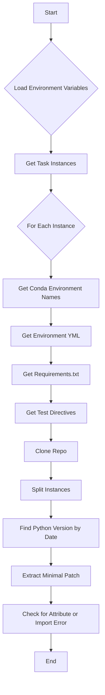

This flowchart represents the sequence of operations performed by the code in the `swe-bench` project file. Each node represents a function or a step in the process, illustrating how the code manages environment variables, interacts with task instances, and processes information related to Python environments, requirements, and repositories.