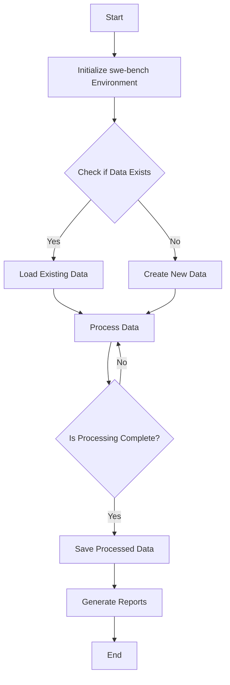

```markdown

```mermaid
graph TD
    A[Start] --> B[Initialize swe-bench Environment]
    B --> C{Check if Data Exists}
    C -->|Yes| D[Load Existing Data]
    C -->|No| E[Create New Data]
    D --> F[Process Data]
    E --> F
    F --> G{Is Processing Complete?}
    G -->|Yes| H[Save Processed Data]
    G -->|No| F
    H --> I[Generate Reports]
    I --> J[End]
```
```