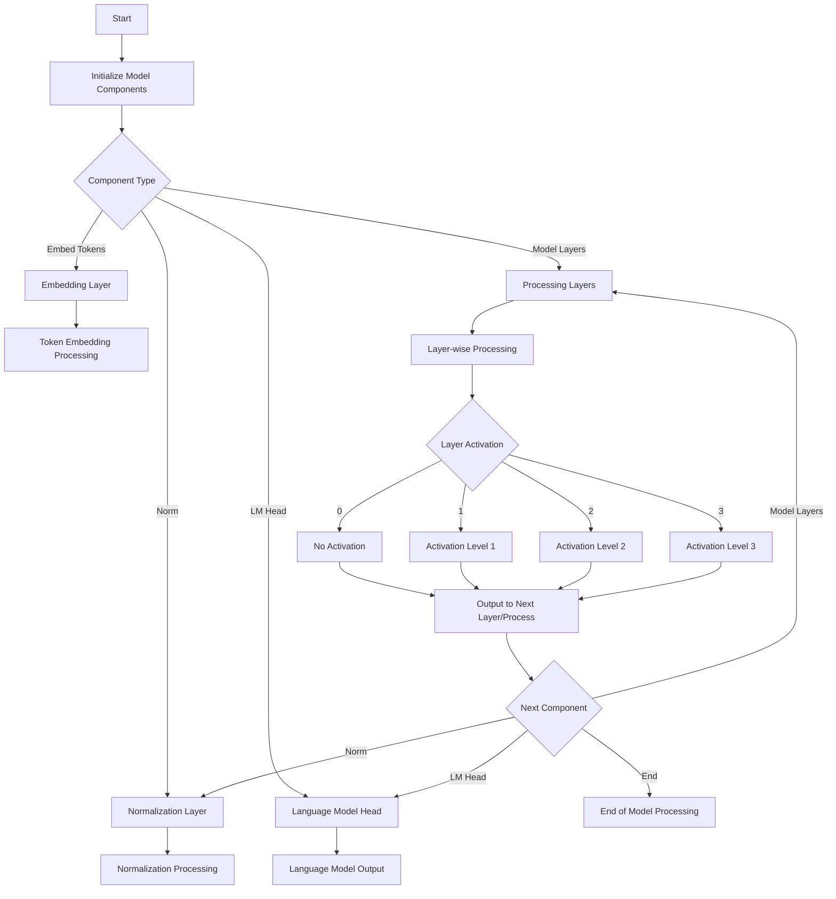

This mermaid diagram represents the flow of processing within a model, starting from initialization, through different types of components (embedding, layers, normalization, and language model head), and detailing how each layer's activation level affects the processing flow.