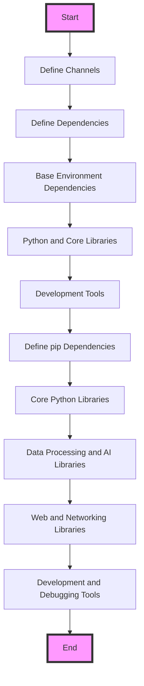

```mermaid
graph TD
    A[Start] --> B[Define Channels]
    B --> C[Define Dependencies]
    C --> D[Base Environment Dependencies]
    D --> E[Python and Core Libraries]
    E --> F[Development Tools]
    F --> G[Define pip Dependencies]
    G --> H[Core Python Libraries]
    H --> I[Data Processing and AI Libraries]
    I --> J[Web and Networking Libraries]
    J --> K[Development and Debugging Tools]
    K --> L[End]

    style A fill:#f9f,stroke:#333,stroke-width:4px
    style L fill:#f9f,stroke:#333,stroke-width:4px
```