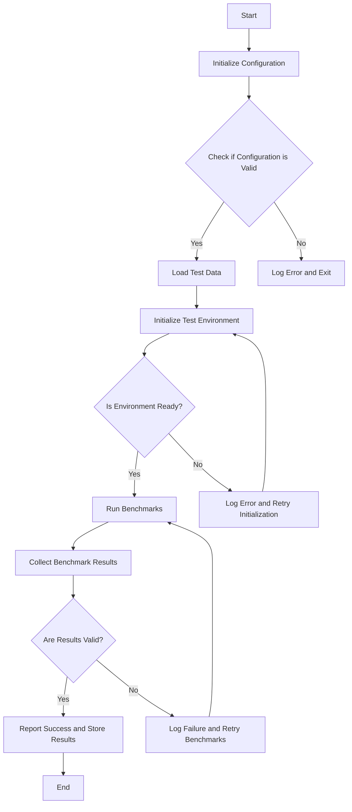

This flowchart represents the logical steps taken by the code in the `swe-bench` project. It starts with initializing the configuration, followed by validating it. If the configuration is invalid, it logs an error and exits. Upon successful validation, it loads test data and initializes the test environment. If the environment is not ready, it logs an error and retries initialization. Once the environment is ready, it runs benchmarks, collects results, and checks their validity. If the results are valid, it reports success and stores the results. If not, it logs a failure and retries the benchmarks.