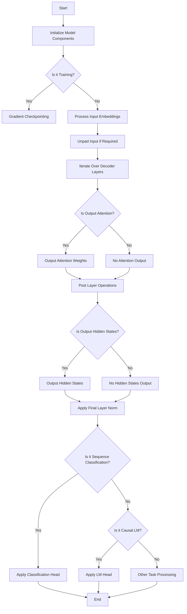

This flowchart represents the general workflow of the code provided, focusing on the initialization of model components, handling of input embeddings, processing through decoder layers, and the application of specific heads based on the task (e.g., sequence classification or causal language modeling). It also highlights conditional paths such as gradient checkpointing during training, outputting attention weights, and hidden states based on configuration flags.