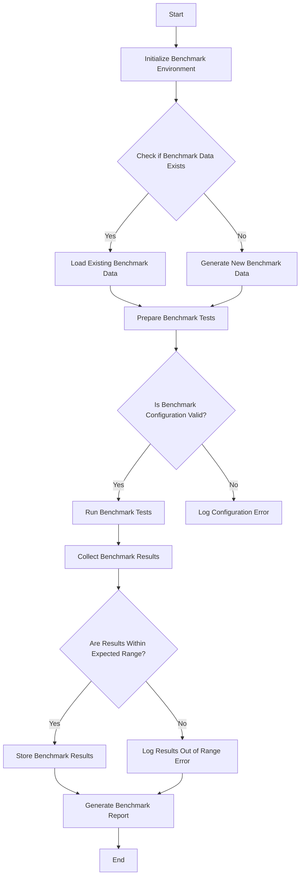

This flowchart represents the steps executed by the code in the `swe-bench` project. It starts with initializing the benchmark environment, followed by checking for existing benchmark data. Depending on whether the data exists, it either loads the existing data or generates new data. After preparing the benchmark tests, it checks if the benchmark configuration is valid. If valid, it runs the benchmark tests; otherwise, it logs a configuration error. Post running the tests, it collects the results and checks if they are within the expected range. If the results are as expected, it stores them and generates a report. If not, it logs an error indicating the results are out of the expected range before generating the report. The process ends after the report generation.