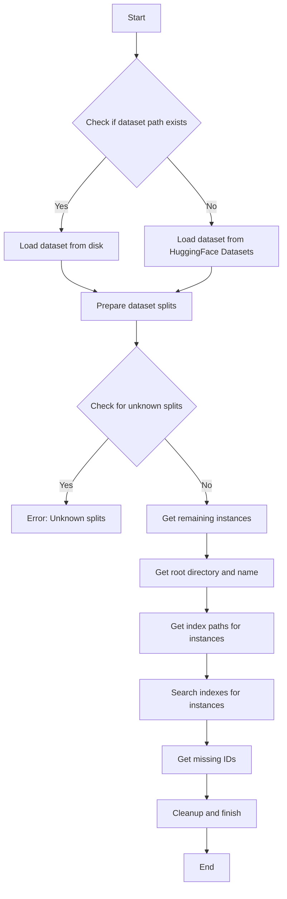

This flowchart represents the process outlined in the provided code, focusing on the main steps involved in preparing, processing, and cleaning up after searching indexes for instances in a dataset. The process starts with checking if the dataset path exists, leading to either loading the dataset from disk or from HuggingFace Datasets. After preparing the dataset splits, it checks for unknown splits, which could lead to an error. Then, it proceeds to get the remaining instances that need processing, prepares the root directory, retrieves index paths for instances, and performs searches on these indexes. Finally, it identifies any missing IDs, cleans up resources, and finishes the process.