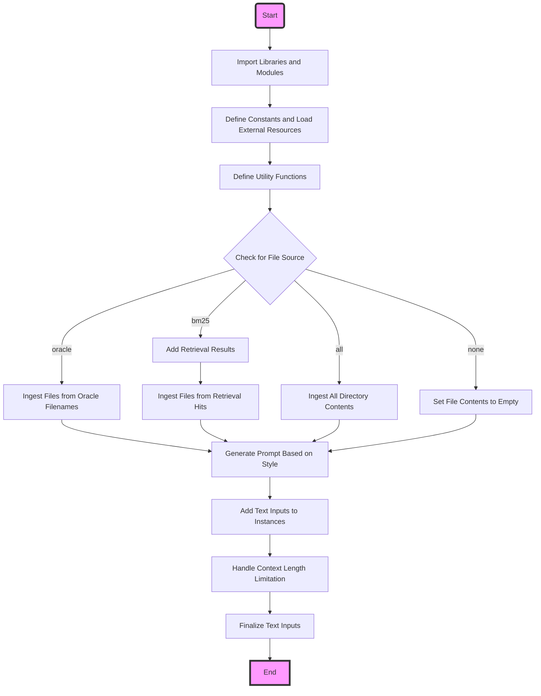

```mermaid
graph TD
    A(Start) --> B[Import Libraries and Modules]
    B --> C[Define Constants and Load External Resources]
    C --> D[Define Utility Functions]
    D --> E{Check for File Source}
    E -->|oracle| F[Ingest Files from Oracle Filenames]
    E -->|bm25| G[Add Retrieval Results]
    E -->|all| H[Ingest All Directory Contents]
    E -->|none| I[Set File Contents to Empty]
    G --> J[Ingest Files from Retrieval Hits]
    F --> K[Generate Prompt Based on Style]
    J --> K
    H --> K
    I --> K
    K --> L[Add Text Inputs to Instances]
    L --> M[Handle Context Length Limitation]
    M --> N[Finalize Text Inputs]
    N --> O[End]

    style A fill:#f9f,stroke:#333,stroke-width:4px
    style O fill:#f9f,stroke:#333,stroke-width:4px
```