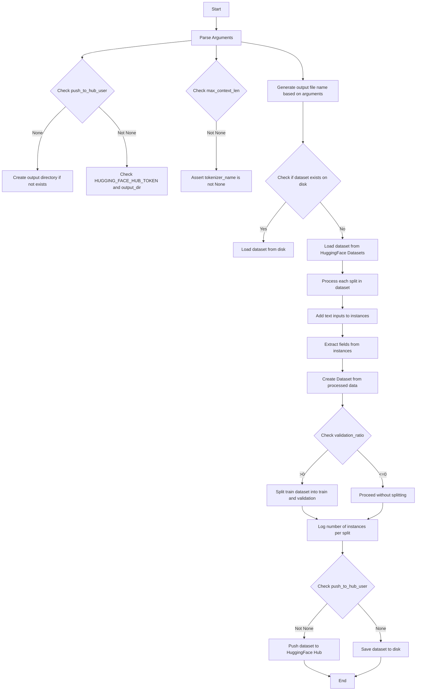

This mermaid diagram illustrates the flow of operations in the provided code snippet. It starts with parsing command-line arguments, checks conditions related to `push_to_hub_user` and `max_context_len`, and decides on the dataset loading strategy. It then processes each dataset split by adding text inputs, extracting necessary fields, and creating a `Dataset` object. Depending on the `validation_ratio`, it may split the training dataset. Finally, it either pushes the dataset to the HuggingFace Hub or saves it to disk, based on the `push_to_hub_user` argument.