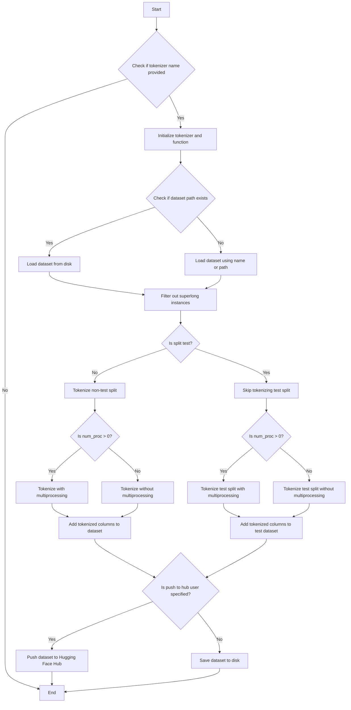

```mermaid
flowchart TD
    A[Start] --> B{Check if tokenizer name provided}
    B -->|Yes| C[Initialize tokenizer and function]
    B -->|No| Z[End without tokenizer initialization]
    C --> D{Check if dataset path exists}
    D -->|Yes| E[Load dataset from disk]
    D -->|No| F[Load dataset using name or path]
    E & F --> G[Filter out superlong instances]
    G --> H{Is split test?}
    H -->|No| I[Tokenize non-test split]
    H -->|Yes| J[Skip tokenizing test split]
    I --> K{Is num_proc > 0?}
    K -->|Yes| L[Tokenize with multiprocessing]
    K -->|No| M[Tokenize without multiprocessing]
    L & M --> N[Add tokenized columns to dataset]
    J --> O{Is num_proc > 0?}
    O -->|Yes| P[Tokenize test split with multiprocessing]
    O -->|No| Q[Tokenize test split without multiprocessing]
    P & Q --> R[Add tokenized columns to test dataset]
    N & R --> S{Is push to hub user specified?}
    S -->|Yes| T[Push dataset to Hugging Face Hub]
    S -->|No| U[Save dataset to disk]
    T & U --> Z[End]
```