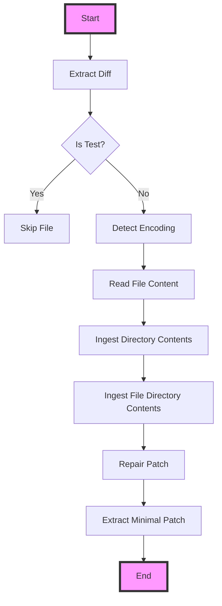

This flowchart represents the sequence of operations performed by the code in the provided context. It starts with extracting diffs from a given input, checks if the file is a test file, detects the file encoding, reads the file content, ingests directory contents, ingests file directory contents, repairs patches, and finally extracts a minimal patch from the given input. The process begins at "Start" and ends at "End", with decision points and operations represented as nodes in the flowchart.