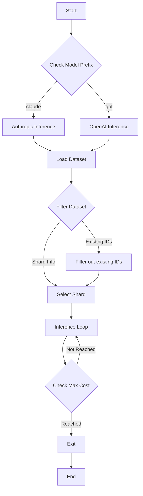

This flowchart represents the high-level logic of the provided code. The process starts with determining the model prefix to decide whether to use the Anthropic or OpenAI inference path. After loading and optionally filtering the dataset based on existing IDs and shard information, it enters an inference loop. Within this loop, it checks if the maximum cost has been reached after each inference call. If the max cost is reached, the process exits; otherwise, it continues with the next inference call until completion.