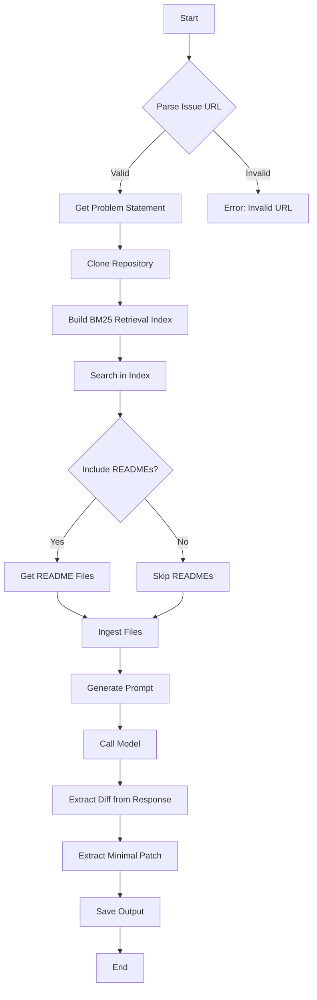

This flowchart represents the steps taken by the code to run a live inference session on a GitHub issue. It starts with parsing the issue URL, retrieving the problem statement, cloning the repository, and building a BM25 retrieval index. It then searches the index, decides whether to include README files, ingests files if necessary, and generates a prompt. The model is called with this prompt, and the response is processed to extract a diff and a minimal patch. Finally, the output is saved, and the process ends.