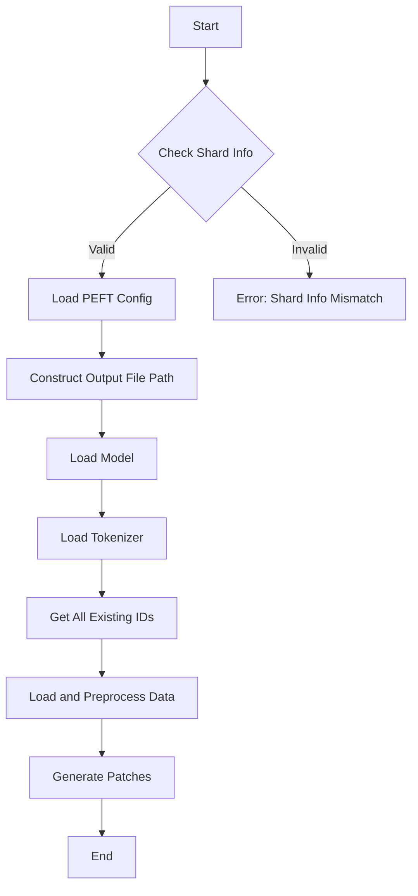

```mermaid
flowchart TD
    A[Start] --> B{Check Shard Info}
    B -->|Valid| C[Load PEFT Config]
    B -->|Invalid| D[Error: Shard Info Mismatch]
    C --> E[Construct Output File Path]
    E --> F[Load Model]
    F --> G[Load Tokenizer]
    G --> H[Get All Existing IDs]
    H --> I[Load and Preprocess Data]
    I --> J[Generate Patches]
    J --> K[End]

    click B "Check if shard_id and num_shards are specified correctly."
    click C "Load PEFT configuration if peft_path is provided."
    click E "Construct the output file path based on parameters."
    click F "Load the model with or without PEFT adapters."
    click G "Load the tokenizer for the model."
    click H "Get all existing instance IDs from the output file to avoid duplicates."
    click I "Load the dataset, tokenize, filter, and shard it."
    click J "Generate patches for the dataset using the model."
```