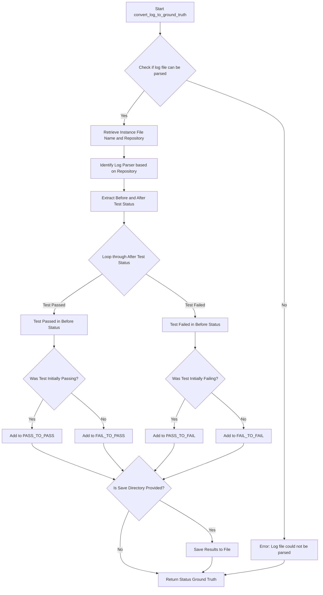

This mermaid markdown code illustrates the steps involved in the `convert_log_to_ground_truth` function from the provided code snippet. It starts with checking if the log file can be parsed, then moves through identifying the repository, selecting the appropriate log parser, extracting before and after test statuses, categorizing tests based on their transitions between statuses, and optionally saving the results to a file if a save directory is provided.