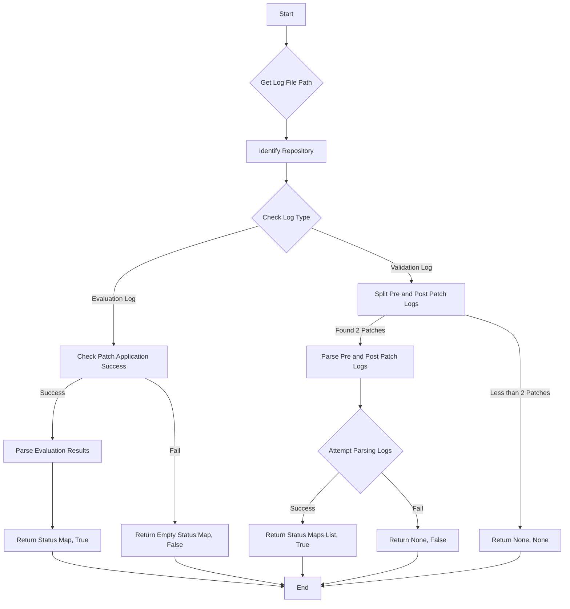

This flowchart represents the process of handling log files in the `swe-bench` project. It starts with obtaining the log file path and identifying the repository associated with it. Based on the log type, it either checks for patch application success in evaluation logs or splits the log into pre and post-patch logs for validation logs. For evaluation logs, if the patch application is successful, it parses the evaluation results; otherwise, it returns an empty status map and `False`. For validation logs, if two patches are found, it attempts to parse the pre and post-patch logs; otherwise, it returns `None` for both. If parsing is successful, it returns a list of status maps and `True`; if not, it returns `None` and `False`. The process ends after handling the logs accordingly.