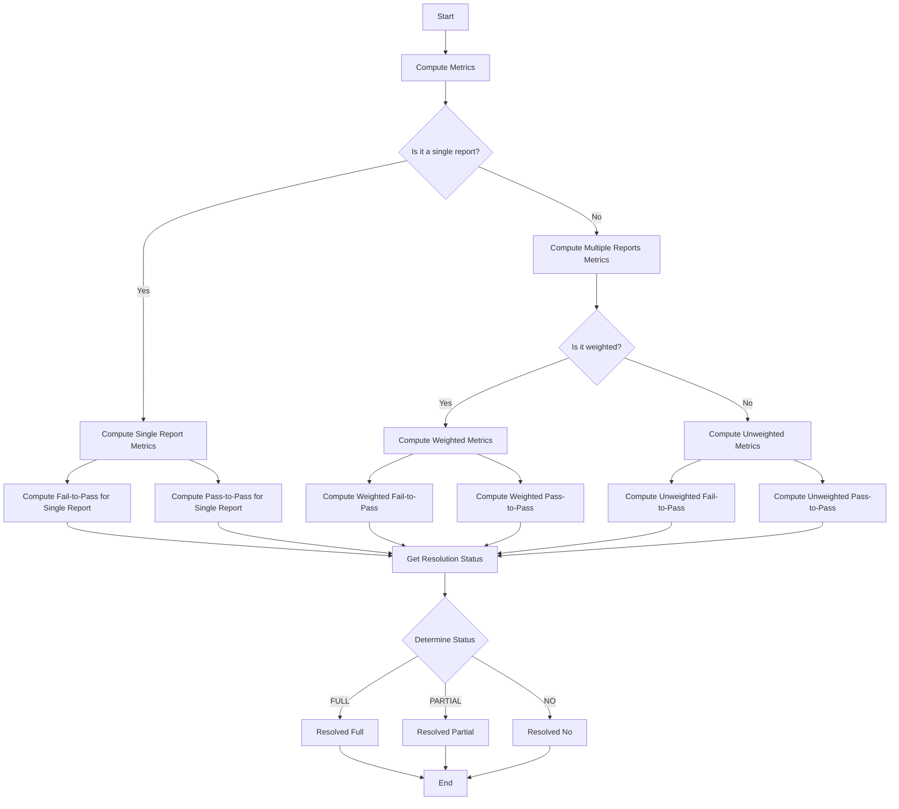

This mermaid diagram illustrates the flow of operations within the provided code. It starts with the decision of whether the input is a single report or multiple reports, followed by further decisions based on the type of computation (weighted or unweighted for multiple reports) and concludes with determining the resolution status based on the computed metrics.