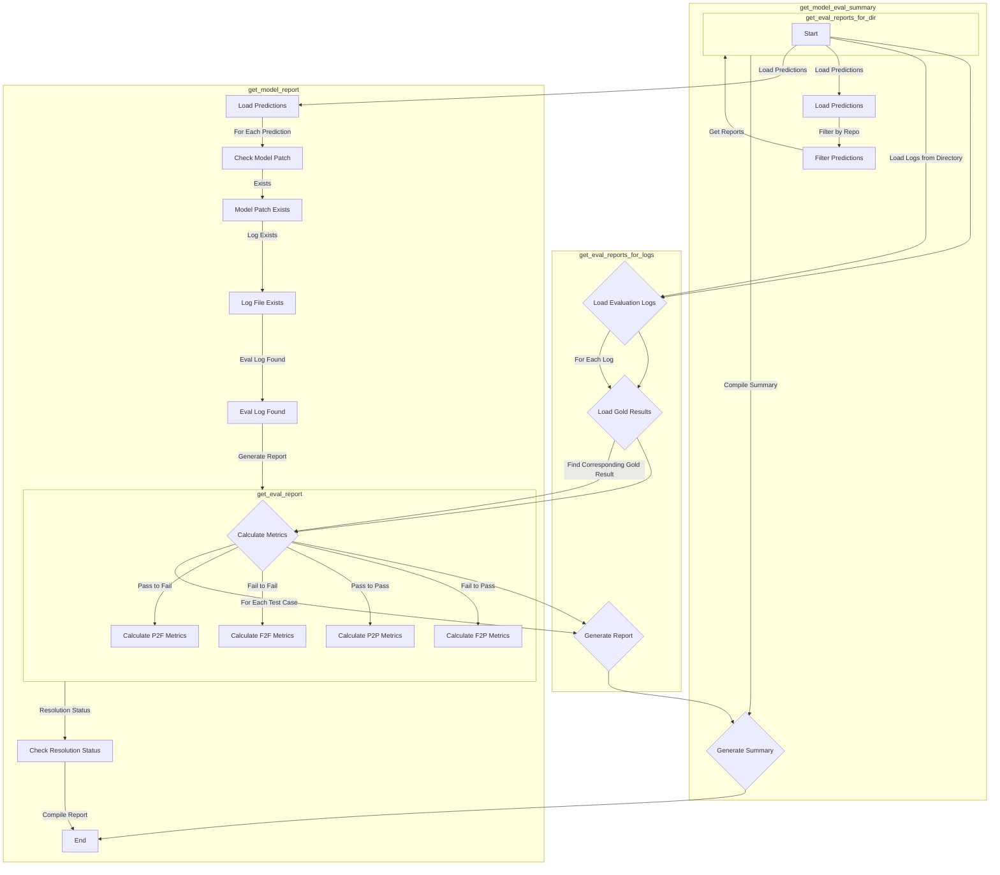

This mermaid diagram illustrates the flow and functionalities of the provided code snippets, focusing on the evaluation report generation, model evaluation summary, and model report generation processes within the larger project context.