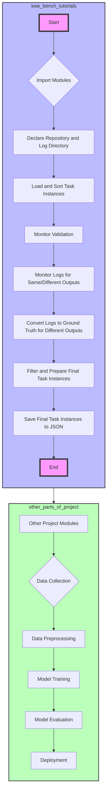

This mermaid markdown code illustrates the steps of the code within the `swe-bench` project's `tutorials` folder, specifically focusing on the validation process. It also shows how this process might fit into the larger project by connecting the tutorial's end to other project modules, indicating a flow from data collection to deployment. This visualization helps in understanding the role of the tutorial within the context of the entire project, emphasizing its position in preparing and validating task instances before they are utilized in further project stages like model training and evaluation.