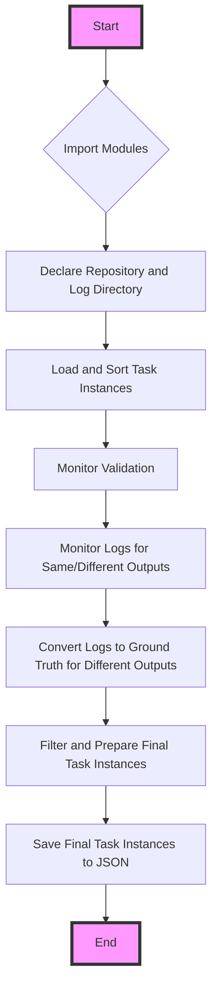

This flowchart represents the sequential steps taken by the code in the provided file. Starting with importing necessary modules, it moves through declaring the repository and log directory, loading and sorting task instances, monitoring validation and log outputs, converting logs to ground truth for differing outputs, filtering and preparing final task instances, and finally saving these instances to a JSON file.