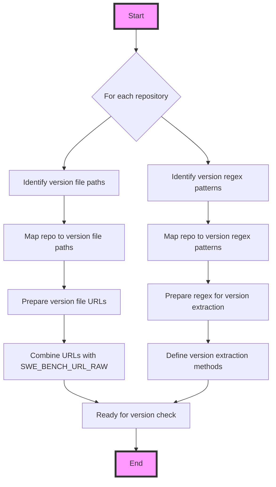

This diagram illustrates the process of mapping repositories to their version file paths and regex patterns for version extraction within the `swe-bench` project. It starts by identifying the necessary file paths and regex patterns for each repository, then maps these to prepare URLs and regex methods for version checking, and finally combines these elements to ready the system for a version check operation.