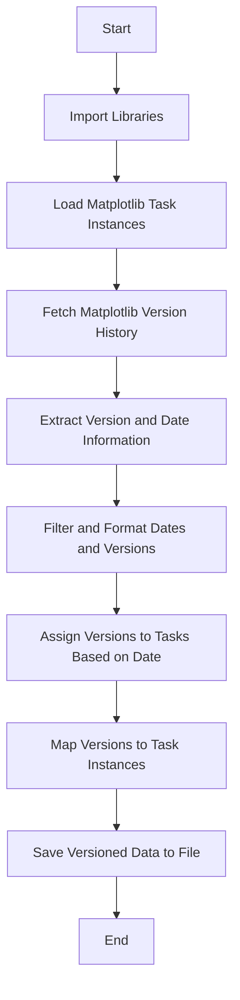

```mermaid
graph TD
    A[Start] --> B[Import Libraries]
    B --> C[Load Matplotlib Task Instances]
    C --> D[Fetch Matplotlib Version History]
    D --> E[Extract Version and Date Information]
    E --> F[Filter and Format Dates and Versions]
    F --> G[Assign Versions to Tasks Based on Date]
    G --> H[Map Versions to Task Instances]
    H --> I[Save Versioned Data to File]
    I --> J[End]
```