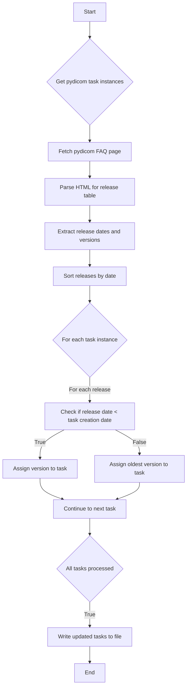

This flowchart represents the process of updating pydicom task instances with their corresponding pydicom version based on the task's creation date and the release dates of pydicom versions. It starts by fetching the task instances and the pydicom FAQ page, then parses the release information, and finally updates each task instance with the appropriate version before saving the updated list.