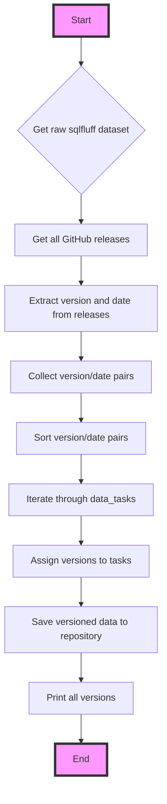

```mermaid
graph TD
    A[Start] --> B{Get raw sqlfluff dataset}
    B --> C[Get all GitHub releases]
    C --> D[Extract version and date from releases]
    D --> E[Collect version/date pairs]
    E --> F[Sort version/date pairs]
    F --> G[Iterate through data_tasks]
    G --> H[Assign versions to tasks]
    H --> I[Save versioned data to repository]
    I --> J[Print all versions]
    J --> K[End]
    
    style A fill:#f9f,stroke:#333,stroke-width:4px
    style K fill:#f9f,stroke:#333,stroke-width:4px
```