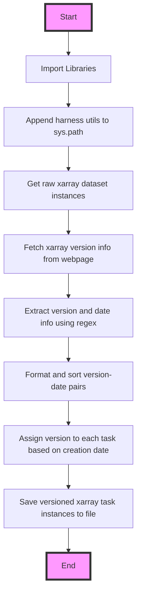

This flowchart represents the sequence of operations performed by the code snippet. It starts with importing necessary libraries and ends with saving the versioned xarray task instances to a file. The process involves fetching and processing version information from the xarray documentation webpage, then assigning the appropriate version to each task based on its creation date before finally saving this enriched dataset.