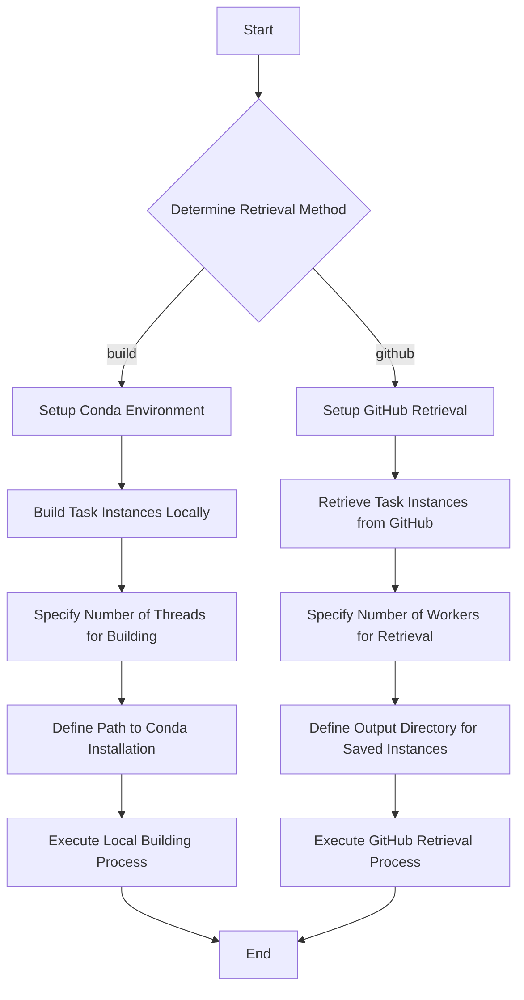

This mermaid diagram illustrates the steps involved in the `get_versions.py` script from the `swe-bench` project, focusing on the process of retrieving versions of task instances either by building them locally or fetching them from GitHub, based on the specified retrieval method.