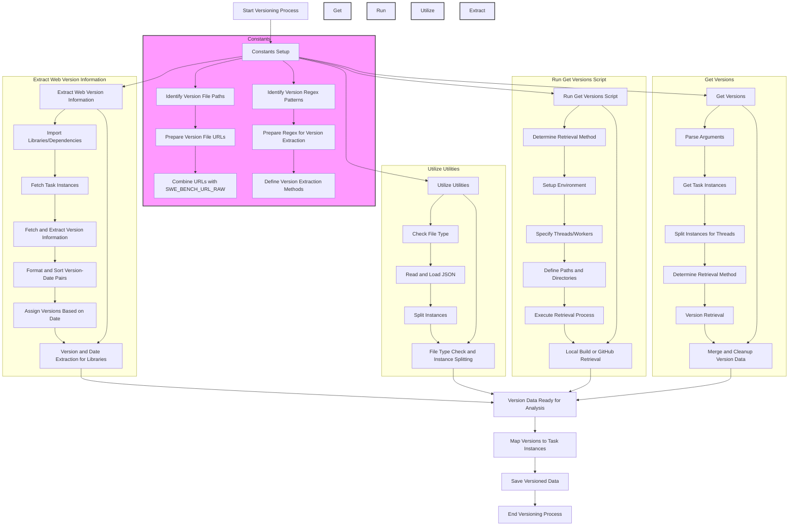

```mermaid
graph TD
    A[Start Versioning Process] --> B[Constants Setup]
    B --> C[Get Versions]
    B --> D[Run Get Versions Script]
    B --> E[Utilize Utilities]
    B --> F[Extract Web Version Information]

    C --> G[Merge and Cleanup Version Data]
    D --> H[Local Build or GitHub Retrieval]
    E --> I[File Type Check and Instance Splitting]
    F --> J[Version and Date Extraction for Libraries]

    G --> K[Version Data Ready for Analysis]
    H --> K
    I --> K
    J --> K

    K --> L[Map Versions to Task Instances]
    L --> M[Save Versioned Data]
    M --> N[End Versioning Process]

    subgraph Constants
        B --> B1[Identify Version File Paths]
        B --> B2[Identify Version Regex Patterns]
        B1 --> B3[Prepare Version File URLs]
        B2 --> B4[Prepare Regex for Version Extraction]
        B3 --> B5[Combine URLs with SWE_BENCH_URL_RAW]
        B4 --> B6[Define Version Extraction Methods]
    end

    subgraph Get Versions
        C --> C1[Parse Arguments]
        C1 --> C2[Get Task Instances]
        C2 --> C3[Split Instances for Threads]
        C3 --> C4[Determine Retrieval Method]
        C4 --> C5[Version Retrieval]
        C5 --> G
    end

    subgraph Run Get Versions Script
        D --> D1[Determine Retrieval Method]
        D1 --> D2[Setup Environment]
        D2 --> D3[Specify Threads/Workers]
        D3 --> D4[Define Paths and Directories]
        D4 --> D5[Execute Retrieval Process]
        D5 --> H
    end

    subgraph Utilize Utilities
        E --> E1[Check File Type]
        E1 --> E2[Read and Load JSON]
        E2 --> E3[Split Instances]
        E3 --> I
    end

    subgraph Extract Web Version Information
        F --> F1[Import Libraries/Dependencies]
        F1 --> F2[Fetch Task Instances]
        F2 --> F3[Fetch and Extract Version Information]
        F3 --> F4[Format and Sort Version-Date Pairs]
        F4 --> F5[Assign Versions Based on Date]
        F5 --> J
    end

    style Constants fill:#f9f,stroke:#333,stroke-width:2px
    style Get Versions fill:#bbf,stroke:#333,stroke-width:2px
    style Run Get Versions Script fill:#bbf,stroke:#333,stroke-width:2px
    style Utilize Utilities fill:#bbf,stroke:#333,stroke-width:2px
    style Extract Web Version Information fill:#bbf,stroke:#333,stroke-width:2px
```