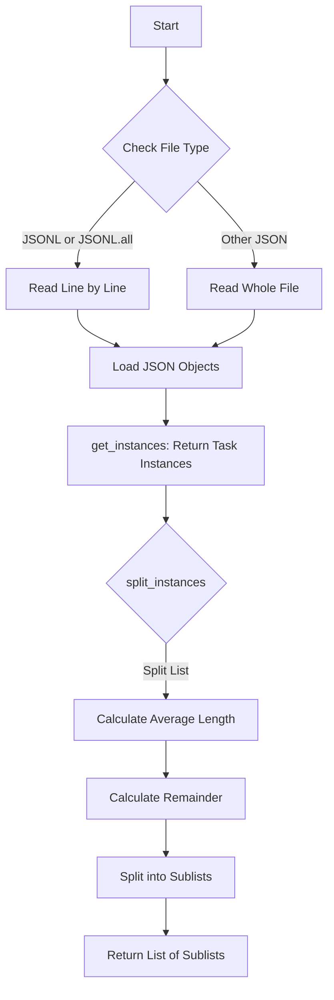

This flowchart represents the process described in the provided code. It starts with determining the type of file based on its extension, then proceeds to read and load the task instances from the file. After obtaining the task instances, it demonstrates how the list of instances can be split into approximately equal-length sublists.